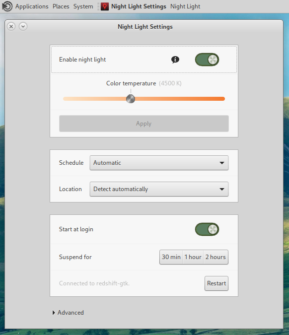

# mate-redshift

A **Night Light Settings** dialog for MATE that configures and controls
[redshift-gtk](http://jonls.dk/redshift/). It appears in MATE Control Center
(Look&Feel or Personal).



## How it integrates with redshift-gtk

redshift-gtk has no IPC of its own, so the dialog uses what it does expose:

| Feature | Mechanism |
|---|---|
| Enable/disable, Suspend for 30 min/1 h/2 h, Autostart | Clicks redshift-gtk's own tray menu items over D-Bus (`com.canonical.dbusmenu`, exported by AppIndicator). The tray checkbox, icon and suspend timer stay in sync, and changes made from the tray show up in the dialog. |
| Enable/disable without AppIndicator | `SIGUSR1` to redshift-gtk, which relays it to redshift. Tray-side toggles can't be observed in this mode, and suspend is unavailable. |
| Autostart | Writes `~/.config/autostart/redshift-gtk.desktop` with the same keys redshift-gtk uses (`Hidden`, `X-GNOME-Autostart-enabled`), plus `X-MATE-Autostart-enabled` for mate-session. Also recognises the packaged `redshift-gtk.service` systemd user unit. |
| Color temperature, schedule, location, brightness, fade | Edits `redshift.conf` in place, keeping your comments. If redshift-gtk was started with `-c FILE`, that file is used instead. |
| Applying settings | Changes take effect when you click **Apply** (or close the window with unapplied changes). redshift can't reload its config, so the file is saved and redshift-gtk is restarted. |
| Preview | While you drag the temperature or brightness controls, the running redshift is frozen (`SIGSTOP`) and the setting is shown with `redshift -P -O`. Three seconds after the last change, or as soon as you click Apply, the screen goes back to the current setting and redshift resumes. |

Full integration needs redshift-gtk to export its tray menu, which it does
through an AppIndicator library:

- Debian/Ubuntu: redshift-gtk is patched to use Ayatana; install
  `gir1.2-ayatanaappindicator3-0.1`.
- Fedora: upstream redshift-gtk uses `libappindicator-gtk3`.

## Build

Build dependencies: `valac`, `meson`, and GTK 3 headers (`gtk3-devel` on Fedora,
`libgtk-3-dev` on Debian). Runtime: `redshift-gtk`.

```sh
meson setup build
ninja -C build
sudo ninja -C build install
```
